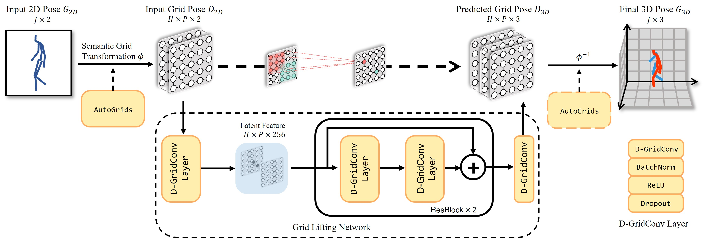

# 3D Human Pose Lifting with Grid Convolution

---
By Yangyuxuan Kang, Yuyang Liu, Anbang Yao, Shandong Wang, and Enhua Wu.

This repository is an official Pytorch implementation of "[3D Human Pose Lifting with Grid Convolution](http://arxiv.org/abs/2302.08760)",
dubbed GridConv. The paper is published in AAAI 2023 as an **oral presentation**.

GridConv is a new powerful representation learning paradigm to lift a 2D human pose 
to its 3D estimation, which relies on a learnable regular weave-like grid pose 
representation instead of the predominant irregular graph structures.


*Figure 1. Overview of grid lifting network regressing 3D human pose from 2D skeleton input.*

Regarding the definition and implementation of SGT designs and grid convolution layers, please refer to our paper
for thorough interpretations.

## Installation

Our experiments are conducted on an GPU server with the Ubuntu 18.04 LTS system, Python 2.7, and PyTorch 1.4.

```
cd GridConv
conda env create -f environment.yml
conda activate gridconv
```

## Dataset Setup

---
### Human3.6M
- Get preprocessed `h36m.zip` ([Google Drive](https://drive.google.com/file/d/168_bVbJA0zMz37_IgYP18XECYT-_FuHM/view?usp=share_link)) 
- `mv h36m.zip ${GridConv_repo}/src/`
- `unzip h36m.zip`


### Customized Dataset
- Directory structure should look like:
```
${GridConv_repo}
├──src
  ├── data
    ├── DATASET_NAME
        ├── train_custom_2d_unnorm.pth.tar
        ├── train_custom_3d_unnorm.pth.tar
        ├── test_custom_2d_unnorm.pth.tar
        ├── test_custom_3d_unnorm.pth.tar
```
- `*_2d_unnorm.pth.tar` are `dict`, whose keys are `(SUBJECT, ACTION, FILE_NAME)` 
  and values are 2d positions with shape of `(N, 34)`.
- `*_3d_unnorm.pth.tar` are `dict`, whose keys are `(SUBJECT, ACTION, FILE_NAME)` 
  and values are `dict` of `{ 'pelvis':N*3, 'joints_3d':N*51, 'camera':[fx,fy,cx,cy] }`.


## Results and Models

*Figure 2. Qualitative results on Internet videos.*

Grid lifting network with 2 residual blocks of D-GridConv, 256 latent channels, 5x5 grid size, 
trained on Human3.6M trainset for 100 epochs.

Evaluation results of pretrained models on Human3.6M testset (S9, S11):

| 2D Detections | SGT design | MPJPE | PA-MPJPE| Google Drive |
|:------:|:------:|:----:|:----:|:----:|
|GT|Handcrafted|37.15|28.32|[model](https://drive.google.com/file/d/1cH9ZhvRe-1dmzczwa2JnyvCmqK1YJcJW/view?usp=share_link)|
|GT|Learnable|36.39|28.29|[model](https://drive.google.com/file/d/1q7YqGKl-i799nRw_oPeL07B5yy__hQP7/view?usp=share_link)|
|HRNet|Handcrafted|47.93|37.85|[model](https://drive.google.com/file/d/14InSsbMeWInM1X5JYWxod0_h3ptXS8O3/view?usp=share_link)|
|HRNet|Learnable|47.56|37.43|[model](https://drive.google.com/file/d/1O45DjCEcKE74c5Nw939Woie0o9lqll54/view?usp=share_link)|

## Evaluation of pretrained models

---
Test on HRNet input using handcrafted SGT:
```
cd ./src
python main.py --eval --input hrnet \
               --load pretrained_model/hrnet_d-gridconv.pth.tar \
               --lifting_model dgridconv --padding_mode c z
```
Test on HRNet input using learnable SGT:
```
python main.py --eval --input hrnet \
               --load pretrained_model/hrnet_d-gridconv_autogrids.pth.tar \
               --lifting_model dgridconv_autogrids --padding_mode c z
```
Test on ground truth input using handcrafted SGT:
```
python main.py --eval --input gt \
               --load pretrained_model/gt_d-gridconv.pth.tar \
               --lifting_model dgridconv --padding_mode c r
```
Test on ground truth input using learnable SGT:
```
python main.py --eval --input gt \
               --load pretrained_model/gt_d-gridconv_autogrids.pth.tar \
               --lifting_model dgridconv_autogrids --padding_mode c r
```


## Training the model from scratch

---
If you want to reproduce the results of our pretrained models, run the following commands.

```
python main.py --exp hrnet_dgridconv-autogrids_5x5 \
               --input hrnet --lifting_model dgridconv_autogrids \
               --grid_shape 5 5 --num_block 2 --hidsize 256 \
               --padding_mode c z
```
Training on 1 1080Ti GPU typically costs about 20 minute per epoch. We train each model for 100 epochs 
with Adam optimizer. Several settings will influence the performance:
- `--grid_shape H W`, we set grid pose as 5x5 size as default. 
  When enabling learnable SGT, grid size can be set as arbitrary values and may have influence on the accuracy.
- `--padding_mode c/z/r c/z/r`, we pad grid pose with 1x1 border before delivering into 
`nn.Conv2d`. c/z/r denote respectively `ciruclar / zeros / replicate` padding. We found 
  `(c,r)` works better for GT input and `(c,z)` for HRNet input.

See [src/tool/argument.py](src/tool/argument.py) for more details about argument setups.

## Citation

---
If you find our work useful in your research, please consider citing:
```
@inproceedings{kang2023gridconv,
  title={3D Human Pose Lifting with Grid Convolution},
  author={Yangyuxuan Kang and Yuyang Liu and Anbang Yao and Shandong Wang and Enhua Wu},
  booktitle={Proceedings of the AAAI Conference on Artificial Intelligence},
  year={2023},
}
```

## License

---
GridConv is released under the Apache license. We encourage use 
for both research and commercial purposes, as long as proper attribution is given.

## Acknowledgement

---
This repository is built based on [ERD_3DPose](https://github.com/kyang-06/ERD_3DPose), [3d_pose_baseline_pytorch](https://github.com/weigq/3d_pose_baseline_pytorch),
and fine-tuned HRNet detection is fetched from [EvoSkeleton](https://github.com/Nicholasli1995/EvoSkeleton).
We thank the authors for kindly releasing the codes.
